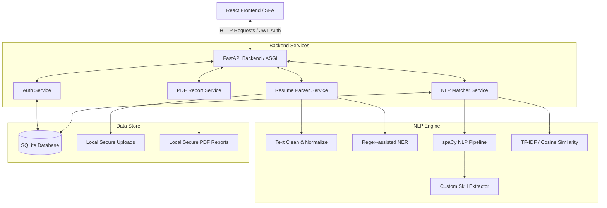

# 🤖 AI Resume Analyzer using NLP

<p align="center">
  
</p>

<p align="center">
  <a href="#python">
    
  </a>
  <a href="#fastapi">
    
  </a>
  <a href="#react">
    
  </a>
  <a href="#sqlite">
    
  </a>
  <a href="#nlp">
    
  </a>
  <a href="#license">
    
  </a>
</p>

---

## 📝 Project Overview

**AI Resume Analyzer using NLP** is a comprehensive, production-ready, full-stack application designed to bridge the gap between job seekers and recruiters. By leveraging state-of-the-art Natural Language Processing (NLP) techniques, the system automatically parses resumes (PDF/DOCX), extracts relevant information, performs semantic keyword analysis, and matches candidates against job descriptions to calculate an ATS compatibility score.

Featuring a beautiful, modern glassmorphism web interface with light/dark modes, it provides recruiters with a unified dashboard to rank applicants, manage users, and view skill analytics. Candidates receive immediate, constructive feedback to optimize their resumes.

---

## ✨ Features

### 🧠 Core NLP Parsing & Matching
*   **Multi-Format Parsing:** Drag-and-drop uploads for `.pdf` (using `pdfplumber` and `PyMuPDF`) and `.docx` (using `python-docx`).
*   **Semantic Information Extraction:** Extracts contact info (name, email, phone) and sections automatically using regex-enhanced NLP.
*   **Skill Taxonomy Matching:** Matches resumes against a taxonomy of over 500+ tech skills grouped into domains.
*   **Cosine Similarity & TF-IDF Scoring:** Measures semantic overlap between the job description and candidate profiles.
*   **Weighted ATS Score:** Computes a composite score (0-100) across 7 critical dimensions:
    1.  *Skill Match* (Hard/Soft skills)
    2.  *Experience Match* (Years, relevance)
    3.  *Education Match* (Degrees, fields)
    4.  *Keyword Density* (Job description key concepts)
    5.  *Formatting & Structure* (Sections detected)
    6.  *Action Verb Usage* (Strength of descriptions)
    7.  *Certifications Match* (Relevant credentials)

### 📊 Recruiter & Candidate Portals
*   **Interactive Dashboard:** Interactive charts built with `Recharts` representing candidate scores, skill distributions, and parsing history.
*   **Smart Suggestions Engine:** Delivers detailed suggestions on how to improve ATS scoring based on missing skills or formatting issues.
*   **Recruiter Admin Console:** Allows recruiters to rank all uploaded resumes against a specific job description, search profiles, and manage users.
*   **PDF Report Generator:** Generates beautiful, styled analysis reports using `fpdf2` for direct download.
*   **Secure Authentication:** Multi-role (Admin/User) JWT authentication with password hashing, password reset mechanisms, and session management.

---

## 🏗️ Technical Architecture

The application adopts a decoupled, modern multi-tier architecture designed for horizontal scalability.



### Key Components:
1.  **Frontend Presentation Layer:** Single Page Application (SPA) built with React 19, structured around clean functional components, context-based state management (`AuthContext`, `ThemeContext`), and custom-designed CSS with CSS variables.
2.  **Backend Controller Layer:** Built on FastAPI, leveraging standard Pydantic schemas for request/response serialization and validation, utilizing routers for module isolation.
3.  **NLP Analytics Engine:** Combines spaCy for text processing (lemmatization, tokenization) with scikit-learn for TF-IDF representations.
4.  **Persistence Layer:** SQLAlchemy ORM operating on an auto-migrating, WAL-enabled SQLite database instance.

---

## 📁 Project Folder Structure

```
AI Resume Analyzer using NLP/
├── backend/                  # FastAPI Application Root
│   ├── main.py               # FastAPI entry point & startup lifespan
│   ├── config.py             # Settings loader using python-dotenv
│   ├── requirements.txt      # Python dependencies
│   ├── download_resources.py # NLTK & spaCy resource downloader
│   ├── database/             # SQLite connection setup & seed scripts
│   │   ├── connection.py     # SQLAlchemy engine & session generators
│   │   └── seed.py           # Default Admin & seed database scripts
│   ├── models/               # SQLAlchemy ORM database models
│   ├── schemas/              # Pydantic schemas for validation/docs
│   ├── routers/              # Endpoint modules (Auth, Admin, Resume, etc.)
│   ├── services/             # Core business logic handlers
│   ├── nlp/                  # Modular Natural Language Processing modules
│   │   ├── pipeline.py       # Main analyzer coordinator
│   │   ├── skill_extractor.py# Skill matcher against 500+ skill taxonomy
│   │   └── similarity.py     # TF-IDF cosine similarity calculations
│   ├── utils/                # PDF/Docx parsers & helpers
│   ├── uploads/              # Local storage for uploaded files (.gitignore'd)
│   ├── reports/              # Local storage for output PDFs (.gitignore'd)
│   └── tests/                # Automated pytest files
├── frontend/                 # React Frontend Application Root
│   ├── src/
│   │   ├── api/              # Axios HTTP client configuration
│   │   ├── context/          # State providers (Theme, JWT Authentication)
│   │   ├── components/       # Reusable layout elements (Navbar, Sidebar, FileUpload)
│   │   ├── pages/            # View components (Dashboard, Profile, Analysis, Admin)
│   │   ├── App.jsx           # Routes definitions
│   │   └── main.jsx          # React app entry point
│   ├── index.html            # Web entry point
│   ├── package.json          # Node dependencies and scripts
│   └── vite.config.js        # Vite compilation configuration
├── docker/                   # Docker deployment configurations
│   ├── Dockerfile.backend    # Python environment runner
│   ├── Dockerfile.frontend   # Node static builder + nginx server
│   └── docker-compose.yml    # Multi-container coordinator
├── samples/                  # Sample jobs/descriptions for testing
├── .env.example              # Template config file
├── .gitignore                # Global ignore rules
├── LICENSE                   # MIT License
└── README.md                 # Project documentation
```

---

## 🚀 Setup & Installation Guide

Follow these steps to run the project locally on your system.

### Prerequisites
*   **Python:** Version `3.11` is recommended.
*   **Node.js:** Version `18.x` or higher (includes `npm`).
*   **Git:** To clone the repository.

---

### Step 1: Clone the Repository
```bash
git clone https://github.com/your-username/ai-resume-analyzer-nlp.git
cd ai-resume-analyzer-nlp
```

---

### Step 2: Backend Configuration & Start

1.  **Navigate into the backend project workspace & create virtual environment:**
    ```bash
    # Create the virtual environment
    python -m venv venv
    
    # Activate virtual environment
    # On Windows (PowerShell):
    venv\Scripts\Activate.ps1
    # On Windows (CMD):
    venv\Scripts\activate.bat
    # On macOS/Linux:
    source venv/bin/activate
    ```

2.  **Install dependencies:**
    ```bash
    pip install --upgrade pip
    pip install -r backend/requirements.txt
    ```

3.  **Download NLP Models and Language Resources:**
    ```bash
    # Run the setup script to download NLTK data and spaCy 'en_core_web_sm'
    python backend/download_resources.py
    ```

4.  **Setup Environment Variables:**
    Create a local environment variables file from the template:
    *   On Windows: `copy .env.example .env`
    *   On Mac/Linux: `cp .env.example .env`
    
    Open `.env` and fill in any secrets. (The defaults work immediately out-of-the-box for development).

5.  **Run the Database Migrations & Seeds:**
    The database will automatically initialize, create tables, and seed a default administrator user the first time you run the backend service.

6.  **Launch the Backend Service:**
    ```bash
    python -m uvicorn main:app --reload --host 127.0.0.1 --port 8000
    ```
    *   **Interactive API Docs (Swagger UI):** Visit `http://localhost:8000/docs`
    *   **Health Check:** `http://localhost:8000/health`
    *   **Seed Admin Username:** `admin@yourdomain.com` (configured in `.env`)
    *   **Seed Admin Password:** `your_secure_admin_password_here` (configured in `.env`)

---

### Step 3: Frontend Configuration & Start

1.  **Navigate to the frontend directory:**
    ```bash
    cd frontend
    ```

2.  **Install Node packages:**
    ```bash
    npm install
    ```

3.  **Run the development server:**
    ```bash
    npm run dev
    ```
    The web page will spin up locally. Open your browser and navigate to `http://localhost:5173`.

---

### Step 4: Docker Compose Setup (Alternative Deployment)

To deploy the entire environment (Frontend, Backend, and Database) in separate, networked containers:

```bash
# Navigate to the docker deployment configuration folder
cd docker

# Run the compose pipeline
docker-compose up --build
```
*   **Web Portal URL:** `http://localhost`
*   **Backend Server URL:** `http://localhost:8000`

---

## 🔌 API Documentation Summary

The FastAPI backend exposes interactive OpenAPI specs. The main endpoint groups include:

| Group | Method | Path | Description | Access |
|---|---|---|---|---|
| **Auth** | `POST` | `/api/auth/register` | Register a new candidate user | Public |
| **Auth** | `POST` | `/api/auth/login` | Retrieve a bearer JWT token | Public |
| **Auth** | `GET` | `/api/auth/me` | Fetch active user profile information | Authenticated |
| **Resume**| `POST` | `/api/resumes/upload` | Upload `.pdf` or `.docx` resume file | Candidate / Admin |
| **Resume**| `GET` | `/api/resumes/` | Get a list of uploaded resumes | Candidate / Admin |
| **JD** | `POST` | `/api/jobs/` | Save a job description text | Recruiter / Admin |
| **Analyze**| `POST` | `/api/analysis/match` | Match resume ID against job description ID | Candidate / Recruiter |
| **Report**| `GET` | `/api/reports/download/{id}` | Generate and export PDF ATS scorecard | Authenticated |
| **Admin** | `GET` | `/api/admin/users` | List registered application users | Admin Only |
| **Admin** | `GET` | `/api/admin/rankings` | Rank candidates by score for a job description | Admin Only |

---

## 🎨 UI Mockups & Screenshots

Below are placeholders representing the interface layouts:

1.  **Landing Page & Login:** Glassmorphic layout containing project value propositions and authentication screens.
2.  **Dashboard & Upload Hub:** File upload interface featuring file type validations and quick-access summary cards.
3.  **ATS Analytics Panel:** Detailed bar chart analysis of skills, experience breakdown, and suggestions list.
4.  **Admin Candidate Ranking Table:** Sorted data grid showing candidate matches, allowing recruiters to sort and select top candidates.

---

## 🔮 Future Scope & Roadmap

*   **Fine-tuned LLM Integration:** Transition cosine similarity checks to fine-tuned embeddings (e.g., using Hugging Face models) to detect semantic synonyms more effectively.
*   **AI Cover Letter Builder:** Automatically draft custom cover letters tailored to the job description using parsed resume details.
*   **Automatic Resume Formatting:** Offer export tools to convert existing resumes into structured templates that comply with standardized parsers.
*   **Multi-User Shared Portals:** Enable direct communications between candidates and recruiters inside the portal interface.

---

## 📄 License

Distributed under the MIT License. See the [LICENSE](file:///c:/Users/Onkar/.gemini/antigravity/scratch/AI%20Resume%20Analyzer%20using%20NLP/LICENSE) file for more information.

---

## 👥 Author & Contact Information

*   **Developer:** Onkar
*   **GitHub Profile:** 
*   **LinkedIn Profile:** (www.linkedin.com/in/omkar-thombare-781017278)
*   **Project Link:** [https://github.com/OMKARTHOMBARE007/AI-Resume-Analyzer-using-NLP.git]
